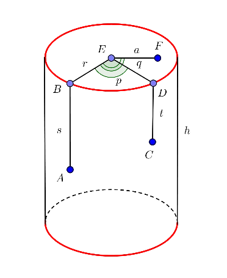

# Answers to Sample Questions posted on TCS Codevita home page

(Under development) In this repo, I have answered the sample questions posted in [this page](https://codevita.tcsapps.com/) using Python. [Archived version](http://web.archive.org/web/20231110040106/https://codevita.tcsapps.com/)


## Table of Answer files

| Question Title | Answer file or directory |
| --- | --- |
| On a Cube | ? |
| Sorting Boxes | ? |
| Sport Stadium | ? |
| Water Cistern | ? |
| Square Free numbers | ? |
| Codu and Sum Love | I don't speak Java (yet) |
Obstacle Game | ? |

## Questions

### On A Cube
A solid cube of 10 cm x 10cm x 10 cm rests on the ground.  It has a beetle on it, and some sweet honey spots at various locations on the surface of the cube.  The beetle starts at a point on the surface of the cube, and goes to the honey spots in order along the surface of the cube.

#### Problem Description
A solid cube of 10 cm x 10cm x 10 cm rests on the ground.  It has a beetle on it, and some sweet honey spots at various locations on the surface of the cube.  The beetle starts at a point on the surface of the cube, and goes to the honey spots in order along the surface of the cube.

1. If it goes from a point to another point on the same face (say X to Y), it goes in an arc of a circle that subtends an angle of 60 degrees at the centre of the circle
2. If it goes from one point to another on a different face, it goes by the shortest path on the surface of the cube, except that it never travels along the bottom of the cube

The beetle is a student of Cartesian geometry, and knows the coordinates (x, y, z) of all the points it needs to go to.  The origin of coordinates it uses is one corner of the cube on the ground, and the z axis points up.  Hence, the bottom surface (on which it does not crawl) is z=0, and the top surface is z=10.  The beetle keeps track of all the distances travelled, and rounds the distance travelled to two decimal places once it reaches the next spot, so that the final distance is a sum of the rounded distances from spot to spot.

#### Input
The first line gives an integer N, the total number of points (including the starting point) the beetle visits

The second line is a set of 3N comma separated non-negative numbers, with up to two decimal places each.  These are to be interpreted in groups of three as the x, y, z coordinates of the points the beetle needs to visit in the given order.

#### Output
One line with a number giving the total distance travelled by the beetle accurate to two decimal places.  Even if the distance travelled is an integer, the output should have two decimal places.

#### Constraints
None of the points the beetle visits is on the bottom face (z=0) or on any of the edges of the cube (the lines where two faces meet)

2<=N<=10

#### Difficulty Level
Complex

#### Time Limit (secs)
1

#### Examples
##### Example 1

**Input**

3

1,1,10,2,1,10,0,1,9

**Output**

4.05

**Explanation**

There are three points visited by the beetle (N=3). The beetle starts on the top face of the cube (z=10) at point (1,1,10) and goes to another point on the same face (2,1,10).  Though the straight line distance is 1, it travels on the arc of a circle subtending an angle of 60 degrees at the centre of the circle, and hence travels (2*pi)/6 or 1.05 (note that it rounds the distance at each leg of the journey).  It then travels from (2,1,10) on the face z=10 to (0,1,9) on the face x=0 along the surface of the cube. This is a distance of 3.  The total distance travelled is 1.05+3=4.05.  The output is 4.05

##### Example 2

**Input**

3

1,1,10,2,1,10,0,5,9

**Output**

6.05

**Explanation**

There are three points visited by the beetle (N=3). The beetle starts on the top face of the cube (z=10) at point (1,1,10) and goes to another point on the same face (2,1,10).  As before. This distance is 1.05.   It then travels from (2,1,10) on the face z=10 to (0,5,9) on the face x=0 along the surface of the cube. The shortest distance on the surface of the cube between these points is 5.  The total distance travelled is 1.05+5=6.05.  The output is 6.05.

### Sorting Boxes
The parcel section of the Head Post Office is in a mess.  The parcels that need to be loaded to the vans have been lined up in a row in an arbitrary order of weights.  The Head Post Master wants them to be sorted in the increasing order of the weights of the parcels, with one exception.  He wants the heaviest (and presumably the most valuable) parcel kept nearest his office.

#### Problem Description
The parcel section of the Head Post Office is in a mess.  The parcels that need to be loaded to the vans have been lined up in a row in an arbitrary order of weights.  The Head Post Master wants them to be sorted in the increasing order of the weights of the parcels, with one exception.  He wants the heaviest (and presumably the most valuable) parcel kept nearest his office.

You and your friend try to sort these boxes and you decide to sort them by interchanging two boxes at a time.  Such an interchange needs effort equals to the product of the weights of the two boxes. 

The objective is to reposition the boxes as required with minimum effort.

#### Input
The first line consists of two space separated positive integers giving the number of boxes (N) and the position of the Head Post Master’s office (k) where the heaviest box must be.

The second line consists of N space separated positive integers giving the weights of the boxes.  You may assume that no two weights are equal.

#### Output
The output is one line giving the total effort taken to get the boxes in sorted order, and the heaviest in position k.

#### Constraints
N<=50

Weights <= 1000

#### Difficulty Level
Complex

#### Time Limit (secs)
1

#### Examples
##### Example 1

**Input**

5 2

20 50 30 80 70

**Output**

3600

**Explanation**

There are 5 boxes (N=5) and the heaviest box must be in position 2 (k=2).  If we look at the final order (sorted, with the heaviest at position 2), it should be 20 80 30 50 70.  If we look at this, we notice that only the 50 and the 80 parcels need to be exchanged.  As this takes effort of the product of the weights, the effort is 4000.   

Further reduction can be obtained if we use the smallest package (20) as an intermediary.  If we exchange 20 with 50 (effort 1000), then with 80 (effort 1600) and back with 50 again (effort 1000), the effect is the same, with a total effort of 3600 (less th an the effort obtained by the direct move)an the effort

The results after the optimal sequence of exchanges are

50 20 30 80 70

50 80 30 20 70

20 80 30 80 70

 

As this takes an effort of 3600, the output is 3600.

##### Example 2

**Input**

6 3

30 20 40 80 70 60

**Output**

7600

**Explanation**

There are 6 parcels, and the heaviest should be at position 3.  Hence the final order needs to be 20 30 80 40 60 70.  If we look at the initial position, we see that 20 and 30 need to be exchanged (effort 600), 40 and 80 need to be exchanged (effort 3200) and 60 and 70 need to be exchanged (effort 4200).  Hence the total effort is 600+3200+4200=8000. 

If we use the same approach as in Example 1, we get the following efforts

 

(600)   20 30 40 80 70 60

(3200) 20 30 80 40 70 60   

(1200) 60 30 80 40 70 20

(1400) 60 30 80 40 20 70

(1200) 20 30 80 40 60 70

A total effort of 7600 is obtained rather than an effort of 8000, which is the output.

### Sport Stadium
It is the sports event of the year for the residents of Sportsville.  Their team had finally made it to the finals of the Bowls League Cup.

#### Problem Description
It is the sports event of the year for the residents of Sportsville.  Their team had finally made it to the finals of the Bowls League Cup.

They have booked tickets for the city contingent for the same row, and the size of the contingent (N) is smaller than the number of seats booked(S).Unfortunately, there was rain the previous night and some of the seats are still wet. Some of the contingent love Bowls so much and are excited enough not to mind sitting on a wet chair. There are k of these. However, others want to sit on a dry seat so that they can enjoy the match more.

The contingent wants to minimize the distance between the first and last person in the row so that they can still conduct Mexican Waves, and other forms of support for their team.

Because they want to sit together, any block of 15 or more contiguous unoccupied seats between the first person sitting and the last person sitting is unacceptable.

There are M blocks of seats, starting with a dry block, with alternating wet and dry blocks.  The number of seats in each block is known.

Given S (the number of seats in the row), N (the size of the contingent),k (the number of the contingent who are willing to sit in a wet seat), and the distribution of wet and dry blocks, write a program to find the minimum distance between the first and the last member of the contingent in the row.


#### Input
The first line contains four comma separated numbers representing S, N, k and M respectively.

The second line is a set of M comma separated numbers representing the number of seats in each block of seats.  The first block is dry, and the remaining blocks alternate between wet and dry.

#### Output
One integer representing the minimum distance between the first and last member of the row.  If it is impossible to seat all the members according to their preferences,and with the unoccupied seat restriction,  the result should be 0.

#### Constraints
S,N,k < 1000,  M < 30

#### Difficulty Level
Complex

#### Time Limit (secs)
1

#### Examples
 

##### Example 1

**Input** 

100,50,5,6

3,10,30,5,30,22

**Output**

49

**Explanation**

S = 100, and there are 100 seats in the row.  N=50, and there are 50 members in the contingent. k=5, and 5 people (out of the 50) do not mind sitting on wet seats.  M=6, and there are 6 blocks of seats.  The number of seats in each block is 3,10,30,5,30 and 22, with the first block of 3 seats being dry, the next 10 being wet and so on. 

One possible positioning to achieve the minimum distance is to place the a set of 30 people in seats 14 to 43 (the dry block), the 5 people who do not mind sitting on wet seats in the wet block 44 to 48, and the remaining 15 people (of the 50) in the seats 49 to 63.  There is no unoccupied seat between the first person and the last person, and so this is acceptable.The distance between the last allocated seat (63) and the first allocated seat (14), is 49.  This is the output.

 

##### Example 2

**Input** 

100,50,5,8

3,7,10,10,20,10,20,20

**Output**

64

**Explanation**

S = 100, and there are 100 seats in the row.  N=50, and there are 50 members in the contingent. k=5, and 5 people (out of the 50) do not mind sitting on wet seats.  M=8, and there are 8 blocks of seats. 

One possible positioning is to have a set of 10 people sit in the dry block 11 – 20, the 5 people who will accept wet seats in seats 21 – 25 (in the wet block 21 – 30), another 20 people in the dry block 31 – 50, leave the wet block 51-60 empty, and seat the remaining 15 people in seats 61 – 75 (in the dry block 61-80.  There is a block of 5 unoccupied seats (26-30) between the first person and the last person.  As this is not more than 15, this is acceptable. The distance from the last allocated seat (75) and the first allocated seat (11) is 64.  This is the result.

### Water Cistern
A cylindrical water cistern was built in an apartment complex in Aquatown. The bottom rests on concrete and is not accessible. It has a height h and a radius r.

#### Problem Description

A cylindrical water cistern was built in an apartment complex in Aquatown.

The bottom rests on concrete and is not accessible. It has a height h and a radius r,

A mathematical bug is sitting on the cistern at point A, and has established a coordinate system to cover the entire accessible area. The bug is sitting a distance s from the top of the cistern, and the nearest point at the top is B.

For a point C on the curved surface, the nearest point D on the top is determined, and the distance CD is taken as t. The angle p (in degrees) subtended at the centre of the circle E by the arc BD is measured (in a counterclockwise manner). The coordinates of C are taken as the pair (t,p), with t being greater than 0 and less than h, and with p being between 0 and 359 (inclusive).

For a point on the top surface, F, the distance to the centre E is taken (a), and the counterclockwise angle (in degrees) between EF and EB is taken. The coordinates of the point F are then taken as (-a,q). The value of a is between 0 and r, and the value of q is between 0 and 359.

All coordinates are integers, and if the point is on the top surface of the cylinder, the first coordinate is negative, and if it is on the curved surface of the cylinder, the first coordinate is positive.

From its staring point A, the bug needs to go to its destination, which is a point (like C or F) either on the curved surface or the top surface. The coordinates of the destination are given. The bug would like to go by the shortest path to its destination.

The goal is to determine the length of the shortest path the bug can take.

#### Input
The first line has three comma separated positive integers giving r (the radius), h (the height of the cylinder) and s (the distance from the top of the starting point of the bug)

The next line has two comma separated integers (d and g) giving the coordinates of the destination. If the first integer (d) is negative, it is on top surface of the cylinder, and else it is on the curved surface of the cylinder

#### Output
The output is a single integer giving the shortest distance that the bug can travel. The computed distance must be rounded to the nearest integer

#### Constraints
40<s<=h<10000

r<100

0<=g<=359

If d is negative, d > -r

If d is positive, d < h

#### Difficulty Level
Complex

#### Time Limit (secs)
1

#### Examples
##### Example 1

**Input**

100,500,200

200,180

**Output**

314

**Explanation**

The value of r is 100, and h is 500. The distance of the bug from the top surface is 200.

The coordinates of the destination are (200,180). As the first coordinate is 200, the destination is on the curved surface (like point C), and at the same distance from the top surface as the bug. As the second coordinate is 180, the destination is exactly on the other side of the cylinder at the same height as the bug, The distance is half the circumference of the cylinder, or 314. This is the output.

##### Example 2

**Input**

100,500,200

-50,180

**Output**

350

**Explanation**

The value of r is 100, and h is 500. The distance of the bug from the top surface is 200.

The coordinates of the destination are (-50,180). As the first coordinate is negative (-50), the point is on the top surface of the cylinder (like point F), and EF is 50. As the second coordinate is 180, BEF is a straight line. The distance travelled is AB + BE + EF = 200 + 100 + 50=350. This is the output.

### Square Free numbers
In the theory of numbers, square free numbers have a special place.  A square free number is one that is not divisible by a perfect square (other than 1).

#### Problem Description
In the theory of numbers, square free numbers have a special place.  A square free number is one that is not divisible by a perfect square (other than 1).  Thus 72 is divisible by 36 (a perfect square), and is not a square free number, but 70 has factors 1, 2, 5, 7, 10, 14, 35 and 70.  As none of these are perfect squares (other than 1), 70 is a square free number.

For some algorithms, it is important to find out the square free numbers that divide a number.  Note that 1 is not considered a square free number. 

In this problem, you are asked to write a program to find the number of square free numbers that divide a given number.

#### Input
The only line of the input is a single integer N which is divisible by no prime number larger than 19

#### Output
One line containing an integer that gives the number of square free numbers (not including 1)

#### Constraints
N   < 10^9

#### Difficulty Level
Simple

#### Time Limit (secs)
1

#### Examples
##### Example 1

**Input**

20

**Output**

3

**Explanation**

N=20

If we list the numbers that divide 20, they are

1, 2, 4, 5, 10, 20

1 is not a square free number, 4 is a perfect square, and 20 is divisible by 4, a perfect square.  2 and 5, being prime, are square free, and 10 is divisible by 1,2,5 and 10, none of which are perfect squares.  Hence the square free numbers that divide 20 are 2, 5, 10.  Hence the result is 3.

##### Example 2

**Input**

72

**Output**

3

**Explanation**

N=72.  The numbers that divide 72 are

1, 2, 3, 4, 6, 8, 9, 12, 18, 24, 36, 72

1 is not considered square free.   4, 9 and 36 are perfect squares, and 8,12,18,24 and 72 are divisible by one of the.  Hence only 2, 3 and 6 are square free.  (It is easily seen that none of them are divisible by a perfect square).  The result is 3


### Codu and Sum Love
Given N number of x's, perform logic equivalent of the above Java code and print the output

#### Problem Description
```java
Scanner sc = new Scanner(System.in);

long sum = 0;

int N = sc.nextInt();

for (int i = 0; i < N; i++) {

final long x = sc.nextLong(); // read input

String str = Long.toString((long) Math.pow(1 << 1, x));

str = str.length() > 2 ? str.substring(str.length() - 2) : str;

sum += Integer.parseInt(str);

}

logger.debug(sum%100);
```

Given N number of x's, perform logic equivalent of the above Java code and print the output

#### Input
First line contains an integer N

Second line will contain N numbers delimited by space

#### Output
Number that is the output of the given code by taking inputs as specified above

#### Constraints
1<=N<=10^7

0<=x<=10^18

#### Difficulty Level
Simple

#### Time Limit (secs)
1

#### Examples
##### Example 1

**Input**

4

8 6 7 4

**Output**

64

##### Example 2

**Input**

3

1 2 3

**Output**

14

### Obstacle Game
Given a n*n Array matrix (A) with A[0][0] element as the starting point and any one element as the destination.

#### Problem Description
Given a n*n Array matrix (A) with A[0][0] element as the starting point and any one element as the destination. Find the destination and print the route map.
Rules:
1. Array Matrix with n*n elements such that n >=2 and n<=10.
2. Starting point A[0][0] value will be 'A'.
3. Destination value will be 'D'
4. There will be always 1 continuous route which can be straight or diagonal.
5. There are 4 types of hurdles and corresponding values :
   1. Stone denoted by 'S'
   2. Wall denoted by 'L'
   3. Water denoted by 'W'
   4. Thorn denoted by 'T'
6. Music provides mind peace. Which will be denoted by 'M'. It is not a hurdle.
7. The value of route will be 'R'.

#### Input
First Line contains dimension N of Matrix A.

Next N Lines, each contains N values delimited by space

#### Output
At every Step print the surrounded hurdles in ascending order of values. i.e. for every 'R' print the surrounding hurdles.

If there are no hurdled around step in the route, print 'NO HURDLES' for that step.

On reaching destination print 'DESTINATION'

Music 'M' is not a hurdle. It should not be included in output.

#### Constraints
2 <= N <= 20

#### Difficulty Level
Simple

#### Time Limit (secs)
1


#### Examples
##### Example 1
**Input**
4
A S L D
T R W R
R M S R
W R R M


**Output**:

L S S T W

T W

S W

S

S W

L S W

DESTINATION

##### Example 2

**Input**:

5

A S L W M

R S L D T

M R T R M

T L R M S

S L S W T

**Output**:

S S

L L S T T

L L S T W

L S T T

DESTINATION